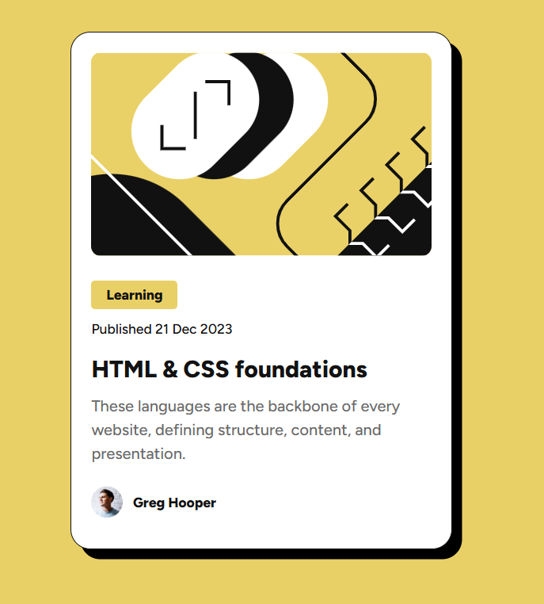

# Frontend Mentor - Blog preview card solution

This is a solution to the [Blog preview card challenge on Frontend Mentor](https://www.frontendmentor.io/challenges/blog-preview-card-ckPaj01IcS). Frontend Mentor challenges help you improve your coding skills by building realistic projects. 

## Table of contents

  - [Overview](#overview)
  - [The challenge](#the-challenge)
  - [Screenshot](#screenshot)
  - [Links](#links)
  - [My process](#my-process)
  - [Built with](#built-with)
  - [What I learned](#what-i-learned)
  - [Useful resources](#useful-resources)
  - [Author](#author)

## Overview

### The challenge

Users should be able to:
- See hover and focus states for all interactive elements on the page

### Screenshot

;


### Links

- [Solution URL](https://github.com/AdonayMendez/frontend-mentor-blog-preview-card)
- Live Site URL: [Add live site URL here](https://your-live-site-url.com)

## My process

### Built with
 - HTML5 
 - CSS

### What I learned

While building this project I learned that in order to use the :focus pseudo-class, the elment must be wrap in a link.

```html
  <h2 class="blog-card-title"><a href="#">HTML & CSS foundations</a></h2>
```

```css
.blog-card-title{
  color: hsl(0, 0%, 7%); 
  font-weight: 800;
  cursor: pointer;

 a{  
  text-decoration: none;
  color: hsl(0, 0%, 7%);
  }
  
  a:hover, a:focus{
  color: hsl(47, 88%, 63%);

  }
}

/* .blog-card-title:hover{
  color: hsl(47, 88%, 63%);
}

.blog-card-title:focus{
  outline: hsl(47, 88%, 63%);
} */
```

### Useful resources

- [MDN Docs](https://developer.mozilla.org/en-US/docs/Web/CSS/Reference/Properties/line-height) - Helped me understand what line height is and different ways that it can be applied. 


### AI Collaboration (ChatGPT)

While trying to position the image, I noticed something very interesting. When I gave the img a height of 100%, both sides (left/right) of the container became visible. When I removed the height and just left it with a width of 100%, the image filled the container. Out of curiosity, I asked ChatGPT why this was the case. I then realized that due to the image having a restricted height, it would ignore object-fit: fill and try to fit the entire image within its constraints.

```css
.blog-img-container{
  background-color: green;
  height: 200px;

  img{
    display: block;
    width: 100%; 
    height: 100%;
    object-fit: fill; 
    object-position: center center; 
    border-radius: 10px;
  }
}
```
vs 
```css
.blog-img-container{
  background-color: green;
  height: 200px;

  img{
    display: block;
    width: 100%; 
    object-fit: fill; 
    object-position: center center; 
    border-radius: 10px;
  }
}
```

I also asked about the :focus pseudo-class because I didn't fully understand how it worked. I eventually learned that the element I'm attaching focus to would have to be wrapped in a link so it could function properly.

```html
  <h2 class="blog-card-title"><a href="#">HTML & CSS foundations</a></h2>
```
```css
  a:hover, a:focus{
  color: hsl(47, 88%, 63%);
```

## Author
- Frontend Mentor - [@AdonayMendez](https://www.frontendmentor.io/profile/AdonayMendez)
